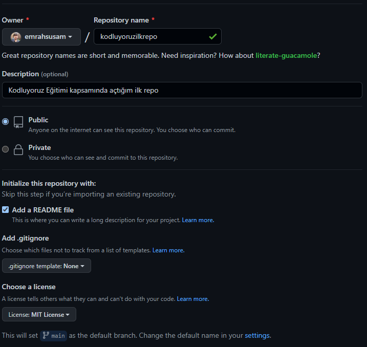

# Kodluyoruz Ilk Repo



Bu repo [Kodluyoruz](https://app.patika.dev/courses/frontend-bootcamp-hazirlik-programi-2hafta) Front-End eğitiminde oluşturduğumuz ilk repo. İçerisinde bir adet README dosyası, bir adet de index.html barındırıyor.

## Installation

Öncelikle repoyu clonelayın. (https://github.com/emrahsusam/kodluyoruzilkrepo.git)

`git clone https://github.com/emrahsusam/kodluyoruzilkrepo.git`

## Usage

Projeyi cloneladıktan sonra Visual Studio Code programında açınız.

Linux için:

```javascript
cd kodluyoruzilkrepo
code .
```

## Contributing

Pull requestler kabul edilir. Büyük değişiklikler için, lütfen önce neyi değiştirmek istediğinizi tartışmak için bir konu açınız.

## License

[MIT](https://github.com/emrahsusam/kodluyoruzilkrepo/blob/main/LICENSE)